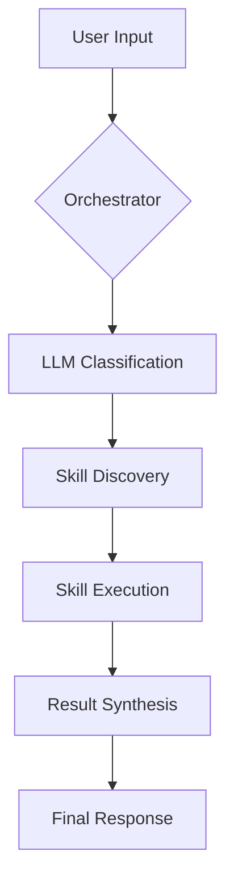

# Architecture Guide for AI Agents

Este documento é destinado a outros agentes de IA para entenderem como operar e estender o **Global Orchestrator**.

## 🏗️ System Flow

O sistema opera em um ciclo de **Classificação -> Seleção -> Execução**.



## 🧩 Modularity Contract

Para estender o sistema, você deve implementar o contrato definido em `core/base_skill.py`.

### BaseSkill Interface
```python
class BaseSkill(ABC):
    @property
    @abstractmethod
    def name(self) -> str: ...
    
    @property
    @abstractmethod
    def description(self) -> str: ...
    
    @abstractmethod
    def execute(self, arguments: Dict[str, Any]) -> Any: ...
```

## 📡 Communication Protocol (JSON)

O Orquestrador utiliza prompts de sistema para forçar o LLM a responder em JSON. O esquema esperado é:

```json
{
  "skill": "string",
  "args": {
    "key": "value"
  },
  "reasoning": "string explanation",
  "response": "optional direct response if fallback"
}
```

## 🧠 Memory Management

O sistema suporta memória de curto prazo via `self.history` dentro da classe `GlobalOrchestrator`.
- **Role**: `user` ou `assistant`.
- **Format**: Lista de dicionários (padrão OpenAI Chat).

## 💡 AI Hint for Extensions

Ao criar uma nova skill, garanta que a `description` seja rica em **verbos de ação** e **contexto de uso**. O Orquestrador usa essa string como critério principal de roteamento.
- **Bom**: "Executa consultas avançadas em bancos de dados SQL para extração de relatórios."
- **Ruim**: "Skill de banco de dados."
